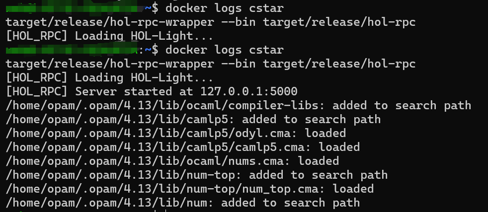
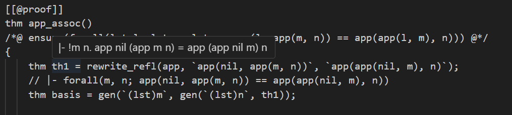
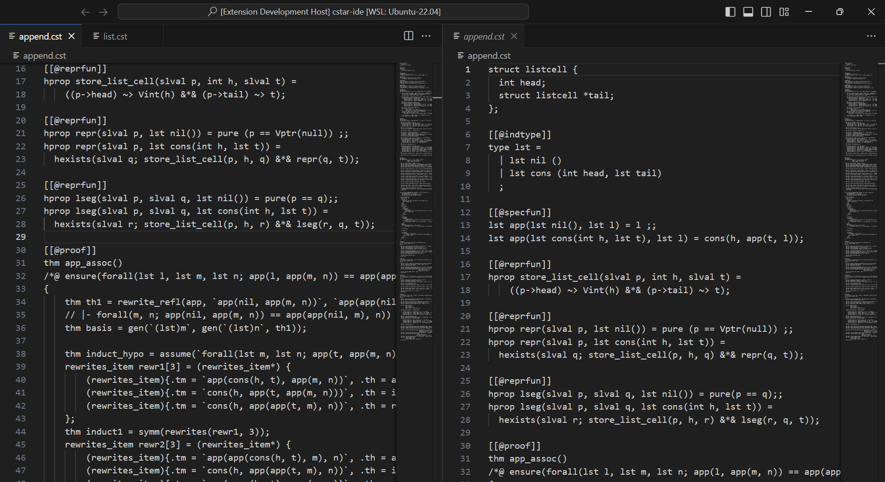
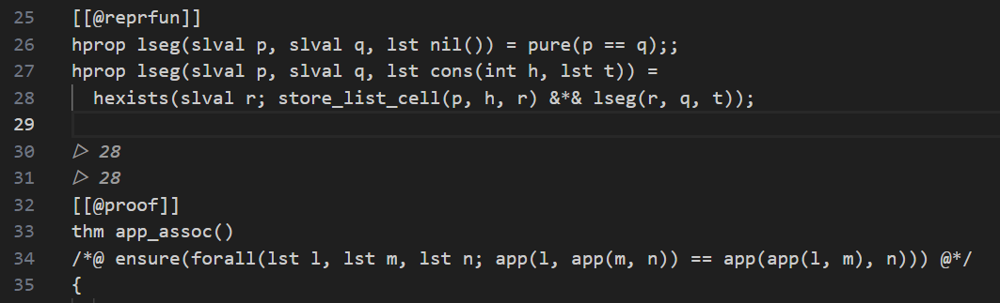

# CStar IDE


## Functionality

This CStar IDE works for */.cst file. It has the following language features:
- [Hover](#hover)
- [Show Post](#show-post)
- [Hide Post](#hide-post)
- [Start Hol-Lite Server](#start-hol-lite-server)
- [Stop Hol-Lite Server](#stop-hol-lite-server)


## Structure

```
.
├── client // Language Client
│   ├── src
│   │   ├── test // End to End tests for Language Client / Server
│   │   └── extension.ts // Language Client entry point
├── package.json // The extension manifest.
└── server // Dumped Language Server
    └── src
        └── server.ts // Language Server entry point
```

## Running the CStar IDE

- Run `npm install` in this folder. This installs all necessary npm modules in both the client and server folder
- Open VS Code on this folder.
- Press Ctrl+Shift+B to start compiling the client and server in [watch mode](https://code.visualstudio.com/docs/editor/tasks#:~:text=The%20first%20entry%20executes,the%20HelloWorld.js%20file.).
- Switch to the Run and Debug View in the Sidebar (Ctrl+Shift+D).
- Select `Launch Client` from the drop down (if it is not already).
- Press ▷ to run the launch config (F5).
- In the [Extension Development Host](https://code.visualstudio.com/api/get-started/your-first-extension#:~:text=Then%2C%20inside%20the%20editor%2C%20press%20F5.%20This%20will%20compile%20and%20run%20the%20extension%20in%20a%20new%20Extension%20Development%20Host%20window.) instance of VSCode, open a document in 'plain text' language mode.
  - Type `j` or `t` to see `Javascript` and `TypeScript` completion.
  - Enter text content such as `AAA aaa BBB`. The extension will emit diagnostics for all words in all-uppercase.

## Enjoy the Features

### Preparatory Work
- LSP-Sample Repo
  - Fix your configuration in package.json (TODO: ondidchangeconfig)
    - cstaride.usedocker
    - cstaride.path
    - cstaride.bdwgcflag
- Hol-Lite Repo
  - use the lsp Branch
- Press ▷ to run the launch config (F5).
### Start Hol-Lite Server
- Press `right-hand button` to see `start hol-lite server in docker`.
- Check the Server:
```sh
docker logs cstar
```



### Stop Hol-Lite Server
- Press `right-hand button` to see `stop hol-lite server`

### Hover
Hover `Theorem Value` :
- open your .csv file.
- make sure the [Hol-Lite Server](#start-hol-lite-server) is running, and you should restart [Hol-Lite Server](#start-hol-lite-server) when some difination changed or the opened file changed.
- save the new file or the changed file, and wait for the fllowing things:
  - cstaride.path/cstar_output:
    - YOUR_FILE_NAME.output.c
    - YOUR_FILE_NAME
    - YOUR_FILE_NAME_log.csv
  - Update LexCache (almost in an instant)
- Move your cursor to the `Theorem Value`.



### Show PostFile
- Press `right-hand button` to see `CStar Show PostFile Here`, or
- Press `Ctrl + Alt + Right`



### Show Post
- Press `right-hand button` to see `CStar Show Post Here`, or
- Press `Alt + Right`



### Hide Post
- Press `right-hand button` to see `CStar Hide Post Once`, or
- Press `Alt + Left`

Please delete the left blank lines by yourself.


