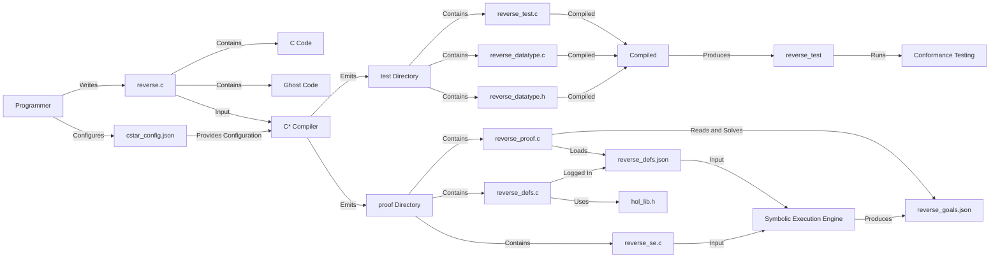

# C* Compiler Architecture and Workflow

This document summarizes the architecture and workflow of the C* compiler, using the `reverse` example. Under the directory `examples/linkedlist/reverse`, the files are organized as follows:

## Source Code
- The programmer writes the `reverse.c` file, which can be compiled and executed using C compilers (clang, gcc, etc.) directly.
- All C* specific information (also known as _ghost code_) needed for extraction is embedded in the attribute syntax (introduced in the C2X standard).

## Configuration
- The `cstar_config.json` file provides configuration (such as default mapping of primitive types) for the C* compiler to generate initial files in the `test` and `proof` directories.

## C* Compilation
- The C* compiler emits files in the `test` and `proof` directories based on the ghost code embedded in `reverse.c` and the configuration file `cstar_config.json`.

## Testing
- In the `test` directory, `reverse_datatype.h`, `reverse_datatype.c`, and `reverse_test.c` are generated.
- These files can be compiled together to form an executable `reverse_test` which can be executed for conformance testing with user-specified ghost specifications with imperative-style proof hints.

## Theory Development and Symbolic Execution
- In the `proof` directory, the C* compiler generates two files: `reverse_se.c` and `reverse_theory.c`.
- `reverse_se.c` is a Separation logic assertion-annotated C file in the VST-IDE annotated syntax (our symbolic execution backend).
  - Ghost commands (e.g., `[[ghost::localval]]`, `[[ghost::command]]`) and assertions (e.g., `[[ghost::assert]]`, `[[ghost::invariant]]`, `[[ghost::require]]`) from `reverse.c` are extracted as a starting point for symbolic execution.
  - If necessary, the proof engineer can further refine the specification.
  - In the assertions, one can use type, function, and predicates defined in `reverse_defs.c`, whose signatures are logged in the `reverse_defs.json` file.
- `reverse_defs.c` is a C file that links with the LCF library implementation of HOL (uses the kernel interface in `hol_lib.h`).
  - It contains the definitions extracted from the ghost code (e.g., `[[ghost::datatype]]`, `[[ghost::function]]`, `[[ghost::predicate]]`) in `reverse.c` as a starting point.
  - The proof engineer can make further definitions and develop the theory for reasoning about functional correctness of `reverse.c`. They can write derived rules and proof automation using any (safe, abstraction preserving) C language features.
- `reverse_se.c`, along with logical type, function, and predicate signatures defined in `reverse_defs.json`, are fed to the symbolic execution engine to produce the file `reverse_goals.json`, which contains the proof obligations (i.e., Separation logic entailments) after symbolic execution.
- `reverse_proof.c` must read and solve all the proof obligations in `reverse_goals.json`. It can use the definitions made in `reverse_defs.c` (loaded them from `reverse_defs.json`).

This architecture and workflow enable the C* compiler to generate the necessary files for testing and verification, while allowing the programmer to write code in C language with additional ghost code and attributes for specification and proof. The proof engineer can make further definitions and develop the theory for reasoning about functional correctness of the code, without communication gap and development environment mismatch.
